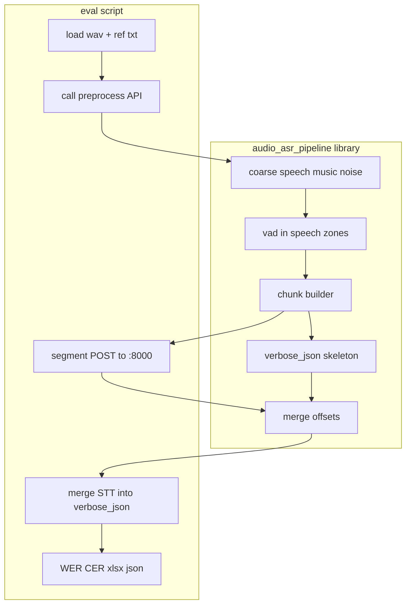

# Модуль препроцессинга + скрипт бенчмарка

## Соответствие [objective.md](C:\projects\transcription_preprocessor_pipeline\objective.md)

**Противоречий нет**, если выполнены три ограничения из ТЗ:

1. **Порядок этапов**: в objective явно: **сначала coarse segmentation** (speech / music / noise / silence — «speech vs music» в широком смысле), **затем VAD** только внутри coarse speech-зон (§2–3). Ваш перечень «VAD → speech vs music» — это удобная группировка возможностей модуля; **в коде** порядок должен быть **coarse → VAD**, иначе это расходится с ТЗ.
2. **Чанкинг**: objective §5 требует нарезку по длине/непрерывности перед Whisper. «Отправка по сегментам» в скрипте = **физические чанки** (или логические сегменты после VAD), согласованные с `max_chunk_duration_sec` — это тот же контракт.
3. **verbose_json**: objective §8 — итоговый merged JSON с глобальными таймкодами. **Заготовка** в модуле (структура + плейсхолдеры под сегменты/слова) + **заполнение** после ответов STT в скрипте полностью совместимы с идеей tolerant merge и `pipeline_meta`.

Дополнительно из objective остаются в силе: отдельные импортируемые стадии (§9), конфиг `PipelineConfig`, логирование длительностей (§11), типизированные ошибки (§12).

## Фаза 1 — переиспользуемый модуль (`audio_asr_pipeline`)

**Назначение:** библиотека без привязки к одному скрипту — импорт в **DAG Airflow**, микросервисах, других CLI.

**Состав публичного «препроцессингового» контура (как вы описали):**

| Блок | Содержание |
|------|------------|
| Speech vs music (coarse) | Классификация зон; по умолчанию inaSpeechSegmenter / абстракция сегментатора (objective §2). |
| VAD | Silero внутри speech-зон; подрезка, merge gap (objective §3). |
| Временные метки | Соответствие обработанного таймлайна исходному файлу; выход — `LabeledSegment` / `AudioChunk` с `start`/`end` в секундах исходника. |
| Заготовка verbose_json | Функция/билдер, возвращающая dict с полями уровня `text`/`segments`/`duration`/`language` и блоком `pipeline_meta` (пустые или частично заполненные), готовый к дополнению ответами STT. |

Плюс из objective **внутри того же пакета** (чтобы скрипт и сервисы не копировали логику):

- **chunking** (§5) — отдельный вызываемый слой между VAD и HTTP;
- **merge** (§8) — чистые функции: смещение таймкодов, склейка `text` и `segments` — импортируются скриптом и при желании любым сервисом.

**Клиент STT** (`VLLMTranscriptionClient`, httpx, retry) может жить в пакете; **вызов** этого клиента для батча файлов в вашем сценарии — в **скрипте** (или в отдельном thin `orchestrator`), чтобы модуль препроцессинга оставался полезен и в сценариях «свой транспорт к STT».

## Фаза 2 — скрипт бенчмарка (после модуля)

Последовательность, как вы перечислили:

1. Принять аудио из `test_audio` (или каталог из CLI).
2. **Препроцессинг через модуль**: coarse + VAD + чанки + таймкоды + заготовка `verbose_json`; замер `t_coarse`, `t_vad`, при необходимости `t_chunking`.
3. **По сегментам/чанкам** — `POST /v1/audio/transcriptions` на `http://127.0.0.1:8000` (как vLLM), ограничение параллелизма по умолчанию **3** (`Semaphore` или лимиты пайплайна).
4. **Заполнить** итоговый `verbose_json` (merge в памяти через функции пакета).
5. **WER / CER** (`jiwer`) к эталону `.txt`, сохранить **verbose_json** на диск, **.xlsx** с колонками из прежнего плана + RT: `audio_duration / (t_coarse+t_vad)`, `audio_duration / t_transcription`.

Эталон: одноимённый `.txt` рядом с `.wav`.

## Архитектура (обновлённо)

## Зависимости и артефакты

- Пакет: `httpx`, asyncio, numpy, soundfile/librosa, silero-vad, inaSpeechSegmenter (как в objective §16), конфиг pydantic/dataclasses.
- Eval extra: `openpyxl`, `jiwer`.
- Выходы скрипта: каталог `verbose/*.json`, `report.xlsx`, краткий stdout.

## Итог для вас

Ваше уточнение **укрупняет** переиспользуемое ядро вокруг препроцессинга и явно откладывает «склейку с STT и отчёт» в отдельный скрипт — это **согласуется** с objective.md при соблюдении порядка **coarse → VAD** и наличии chunking + merge в пакете как **импортируемых** стадий (§5, §8, §9).
