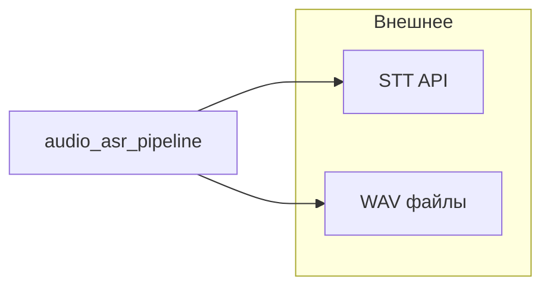
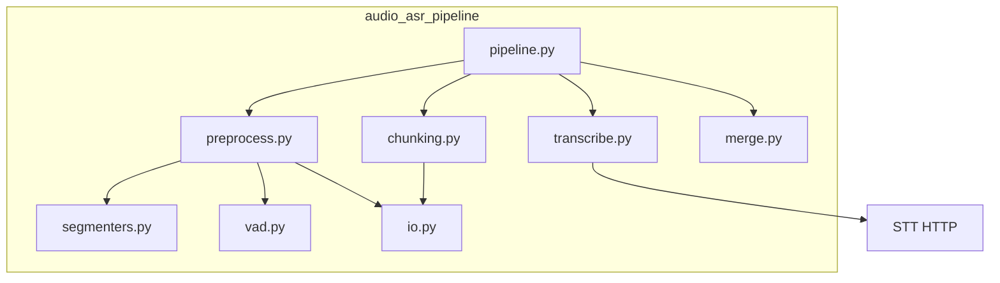

# Audio ASR pipeline

Библиотека **`audio_asr_pipeline`**: грубая сегментация речи/музыки/шума, VAD (Silero через ONNX), нарезка чанков, вызов **OpenAI-совместимого** STT (`/v1/audio/transcriptions`), склейка текста и **`verbose_json`**.

Подробная архитектура (C4, последовательности, ошибки, лимиты): [docs/ARCHITECTURE.md](docs/ARCHITECTURE.md).

## Конвейер данных (кратко)

1. Загрузка WAV → нормализация сэмплрейта / моно (по конфигу).
2. **Coarse** (`ina` или `whole_file`) → интервалы с метками.
3. **VAD** уточняет границы речи; фильтрация музыки/шума/тишины по конфигу.
4. **Chunking** — WAV-байты на чанк для HTTP.
5. **Transcribe** — multipart POST в STT (общий `httpx.AsyncClient`, лимиты `max_in_flight_requests` / `max_concurrent_chunks`).
6. **Merge** — итоговый текст и `verbose_json`.

Упрощённая схема модулей (см. также Mermaid в [ARCHITECTURE.md](docs/ARCHITECTURE.md)):





| Модуль | Роль |
|--------|------|
| `pipeline.py` | `AudioTranscriptionPipeline`, `process_file_sync`, оркестрация |
| `preprocess.py` | coarse + VAD + спаны |
| `segmenters.py` | `ina` / `whole_file` |
| `vad.py` | Silero ONNX |
| `chunking.py` | ограничения длины чанка |
| `transcribe.py` | OpenAI-form POST, ретраи / 429 |
| `merge.py` | склейка ответов |
| `config.py` | `PipelineConfig`, `VLLMTranscribeConfig` |

Результат **`PipelineResult`**: `text`, `verbose_json`, `stats`, опционально **`error`** — при `fail_fast=False` сбой одного файла в батче не валит остальные (см. [ARCHITECTURE.md](docs/ARCHITECTURE.md)).

## Установка

```bash
uv sync
uv sync --extra eval   # jiwer + openpyxl для scripts/eval_test_audio.py
uv sync --extra ina    # inaSpeechSegmenter (дефолтный coarse); на Windows в pyproject pin plain tensorflow
```

Пины в **`uv.lock`**. Для **pip**: **`requirements-minimal.txt`** (ядро) или **`requirements.txt`** (extras + dev). Далее: `pip install -e .` из корня репозитория (пакет объявлен в [pyproject.toml](pyproject.toml)).

## Eval (батч WAV → XLSX + verbose_json)

```bash
uv run python scripts/eval_test_audio.py --audio-dir test_audio --base-url http://127.0.0.1:8000
uv run python scripts/eval_test_audio.py -v ...   # лог каждого POST в STT
# Стерео call-center: канал 0 = call_from, 1 = call_to; эталоны <stem>_call_from.txt и <stem>_call_to.txt
uv run python scripts/eval_test_audio.py --stereo-call --audio-dir ... --base-url http://127.0.0.1:8000
```

По умолчанию **`trust_env=False`** у httpx (локальный STT не уезжает в `HTTP_PROXY`). Включайте **`--trust-env`** только если прокси нужен.

Дефолтный coarse — **`ina`**: `uv sync --extra ina`. TF для ina по умолчанию на CPU (`ina_force_cpu`); флаг eval **`--ina-allow-gpu`** разрешает GPU. Без ina: **`--coarse-backend whole_file`**.

## Apache Airflow

Паттерны интеграции (async `await pipeline.process_file` vs **`process_file_sync`** в синхронных тасках, вложенный event loop, XCom, **`expand` по списку путей**): [docs/AIRFLOW.md](docs/AIRFLOW.md).

Рекомендация: **`audio_asr_pipeline` ставить в образ/venv воркера** (`pip install .` / wheel), а не копировать исходники в DAG. Пример двух DAG (стерео call-center + моно) и тонкий слой **`plugins/asr_helpers`**: [airflow_scaffold/README.md](airflow_scaffold/README.md).

## Прочее

Cursor skill для агентов: [.cursor/skills/audio-asr-pipeline/SKILL.md](.cursor/skills/audio-asr-pipeline/SKILL.md).
