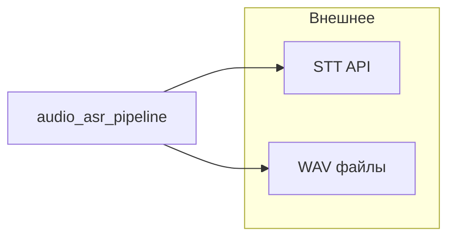
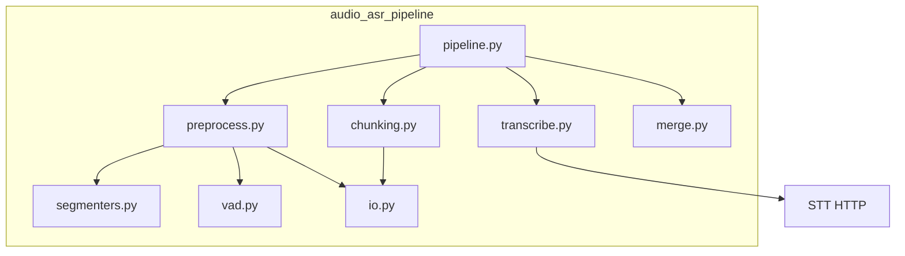

# Audio ASR pipeline

Библиотека **`audio_asr_pipeline`**: грубая сегментация речи/музыки/шума, VAD (Silero через ONNX), нарезка чанков, вызов **OpenAI-совместимого** STT (`/v1/audio/transcriptions`), склейка текста и **`verbose_json`**.

Подробная архитектура (C4, последовательности, ошибки, лимиты): [docs/ARCHITECTURE.md](docs/ARCHITECTURE.md).

## Конвейер данных (кратко)

1. Загрузка WAV → нормализация сэмплрейта / моно (по конфигу).
2. **Coarse** (`ina` или `whole_file`) → интервалы с метками.
3. **VAD** уточняет границы речи; фильтрация музыки/шума/тишины по конфигу.
4. **Chunking** — WAV-байты на чанк для HTTP.
5. **Transcribe** — вызов STT через `openai` `AsyncOpenAI` (по умолчанию) или `httpx` (fallback); лимит `max_in_flight_requests`.
6. **Merge** — итоговый текст и `verbose_json`.

Упрощённая схема модулей (см. также Mermaid в [ARCHITECTURE.md](docs/ARCHITECTURE.md)):





| Модуль | Роль |
|--------|------|
| `pipeline.py` | `AudioTranscriptionPipeline`, `process_file_sync`, оркестрация |
| `preprocess.py` | coarse + VAD + спаны |
| `segmenters.py` | `ina` / `whole_file` |
| `vad.py` | Silero ONNX |
| `chunking.py` | ограничения длины чанка |
| `transcribe.py` | STT: `OpenAITranscriptionClient` (openai lib) / `VLLMTranscriptionClient` (httpx); ретраи / 429 |
| `merge.py` | склейка ответов |
| `config.py` | `PipelineConfig`, `VLLMTranscribeConfig` |

Результат **`PipelineResult`**: `text`, `verbose_json`, `stats`, опционально **`error`** — при `fail_fast=False` сбой одного файла в батче не валит остальные (см. [ARCHITECTURE.md](docs/ARCHITECTURE.md)).

## Установка

```bash
uv sync                # ставит ВСЕ зависимости (core + eval + ina + dev) через dependency-groups
uv sync --no-group ina # без inaSpeechSegmenter / TensorFlow (лёгкий режим, coarse = whole_file)
```

Пины в **`uv.lock`**. Для **pip**: `pip install -e .[eval,ina]` из корня репозитория. Минимальный pip-набор: `pip install -e .` (без jiwer/openpyxl/ina). Экспорт lock-файла: **`requirements-minimal.txt`** (ядро).

## Eval (батч WAV → XLSX + verbose_json)

```bash
# По умолчанию STT через openai клиент (рекомендуется для vLLM):
uv run python scripts/eval_test_audio.py --audio-dir test_audio --base-url http://127.0.0.1:8000

# С API-ключом (vLLM --api-key):
uv run python scripts/eval_test_audio.py --audio-dir test_audio --base-url http://127.0.0.1:8000 --api-key sk-xxx

# Через httpx (raw multipart POST):
uv run python scripts/eval_test_audio.py --stt-backend httpx --audio-dir test_audio --base-url http://127.0.0.1:8000

uv run python scripts/eval_test_audio.py -v ...   # лог каждого POST в STT
# Стерео call-center: канал 0 = call_from, 1 = call_to; эталоны <stem>_call_from.txt и <stem>_call_to.txt
uv run python scripts/eval_test_audio.py --stereo-call --audio-dir ... --base-url http://127.0.0.1:8000
```

По умолчанию **`trust_env=False`** (локальный STT не уезжает в `HTTP_PROXY`). Включайте **`--trust-env`** только если прокси нужен.

Дефолтный coarse — **`ina`** (`uv sync` ставит его автоматически). TF для ina по умолчанию на CPU (`ina_force_cpu`); флаг eval **`--ina-allow-gpu`** разрешает GPU. Без ina: **`--coarse-backend whole_file`**.

## Eval stereo call-center (два канала + .txt-эталоны)

Режим `--stereo-call` предназначен для стерео WAV-записей телефонных звонков, где каждый канал содержит речь отдельного участника. Скрипт разделяет стерео на два моно-файла, прогоняет каждый через пайплайн независимо и сравнивает результат с эталонными текстами.

### Структура директории

Все `.wav` и `.txt` лежат в одной папке. Для каждого стерео WAV создаётся пара эталонных текстов по шаблону имени:

```
stereo_wavs/
  call_001.wav                  # стерео WAV (2 канала)
  call_001_call_from.txt        # эталон для канала 0 (звонящий)
  call_001_call_to.txt          # эталон для канала 1 (принимающий)
  call_002.wav
  call_002_call_from.txt
  call_002_call_to.txt
  call_003.wav                  # .txt необязательны — без них WER/CER будут пустыми
```

- **Канал 0** (`call_from`) — звонящий (левый канал стерео).
- **Канал 1** (`call_to`) — принимающий (правый канал стерео).
- `.txt`-файлы: обычный текст в UTF-8, одна или несколько строк. Пустые строки игнорируются, непустые склеиваются через пробел.
- Если `.txt` отсутствует или пуст — строка в XLSX всё равно появится, но колонки WER/CER и эталон будут пустыми, а расхождения покажут «нет эталона».
- Если эталон есть, но гипотеза пуста (пайплайн не распознал речь) — WER и CER выставляются в `1.0`.

### Запуск для vLLM

```bash
uv run python scripts/eval_test_audio.py \
  --stereo-call \
  --audio-dir ./stereo_wavs \
  --base-url http://127.0.0.1:8000 \
  --api-key sk-your-vllm-key \
  --model large-v3-turbo \
  --concurrency 6 \
  --language ru \
  --coarse-backend ina \
  --output-dir ./eval_results \
  -v
```

### Описание флагов

| Флаг | Значение по умолчанию | Описание |
|------|----------------------|----------|
| `--stereo-call` | выкл | Включает стерео-режим: канал 0 = `call_from`, канал 1 = `call_to`. Каждый канал обрабатывается как отдельный моно-файл. Один стерео WAV занимает **два** слота параллелизма. |
| `--audio-dir` | `test_audio` | Путь к директории с `.wav`-файлами (и `.txt`-эталонами рядом с ними). |
| `--base-url` | `http://127.0.0.1:8000` | URL STT-сервера (OpenAI-совместимый endpoint). Для vLLM: адрес, на котором запущен `vllm serve`. |
| `--api-key` | нет | API-ключ для авторизации на STT-сервере (отправляется как `Authorization: Bearer <key>`). Обязателен, если vLLM запущен с `--api-key`. |
| `--stt-backend` | `openai` | Бэкенд HTTP-клиента: `openai` (библиотека `openai`, рекомендуется для vLLM — нативные ретраи, авторизация, connection pool) или `httpx` (raw multipart POST). |
| `--model` | `large-v3-turbo` | Название модели Whisper на сервере. Передаётся в поле `model` запроса. |
| `--language` | нет (авто) | Код языка ISO 639-1 (`ru`, `en`, `de` и т.д.). Если не задан, модель определяет язык автоматически. |
| `--concurrency` | `3` | Максимум файлов, обрабатываемых параллельно (препроцессинг + STT). В стерео-режиме один WAV занимает два слота (по каналу). Рекомендуется ставить кратно числу GPU-воркеров на STT-сервере. |
| `--coarse-backend` | `ina` | Грубый сегментатор: `ina` (inaSpeechSegmenter — отделяет речь от музыки/шума) или `whole_file` (всё аудио считается речью, быстрее, но без фильтрации). |
| `--ina-allow-gpu` | выкл | Разрешить TensorFlow (для ina) использовать GPU. По умолчанию ina работает на CPU. |
| `--output-dir` | `eval_runs/<UTC_timestamp>` | Директория для результатов. Внутри создаются `report.xlsx`, `verbose_json/`, `stereo_mono_wav/`, `eval.log`. |
| `-v` / `--verbose` | выкл | Включает уровень DEBUG для eval-скрипта и пакета `audio_asr_pipeline`. Показывает каждый POST в STT, семафоры, тайминги. |
| `--log-level` | `INFO` | Уровень логирования (`DEBUG`, `INFO`, `WARNING`, `ERROR`). `-v` форсирует `DEBUG`. |
| `--log-file` | `<output-dir>/eval.log` | Путь к файлу лога. По умолчанию создаётся рядом с `report.xlsx`. |
| `--no-log-file` | выкл | Логировать только в stderr (не создавать файл лога). |
| `--trust-env` | выкл | Разрешить httpx использовать `HTTP_PROXY` / `HTTPS_PROXY` из окружения. По умолчанию выключено, чтобы локальный STT не уходил через прокси. |

### Что на выходе

```
eval_results/
  report.xlsx              # XLSX с листами per_file и summary
  verbose_json/
    call_001_call_from_verbose.json
    call_001_call_to_verbose.json
    call_002_call_from_verbose.json
    ...
  stereo_mono_wav/
    call_001__call_from.wav    # моно WAV канала 0 (промежуточный)
    call_001__call_to.wav      # моно WAV канала 1
    ...
  eval.log                 # полный лог прогона
```

Лист **per_file** в `report.xlsx` содержит для каждого стерео WAV: тайминги препроцессинга и транскрипции по каналам, эталонный и гипотезный текст, WER/CER по каналам и overall, описание расхождений.

Лист **summary** — агрегаты (mean, median, p25, p75) по WER/CER, длительностям, RT-метрикам.

## Apache Airflow

Паттерны интеграции (async `await pipeline.process_file` vs **`process_file_sync`** в синхронных тасках, вложенный event loop, XCom, **`expand` по списку путей**): [docs/AIRFLOW.md](docs/AIRFLOW.md).

Рекомендация: **`audio_asr_pipeline` ставить в образ/venv воркера** (`pip install .` / wheel), а не копировать исходники в DAG. Пример двух DAG (стерео call-center + моно) и тонкий слой **`plugins/asr_helpers`**: [airflow_scaffold/README.md](airflow_scaffold/README.md).

## Прочее

Cursor skill для агентов: [.cursor/skills/audio-asr-pipeline/SKILL.md](.cursor/skills/audio-asr-pipeline/SKILL.md).
