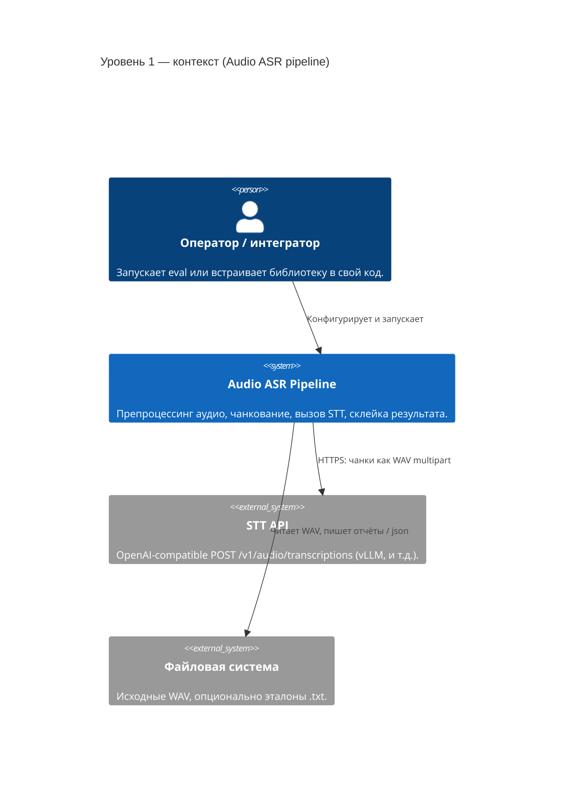
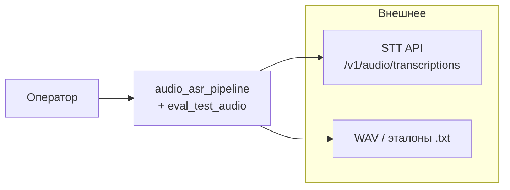
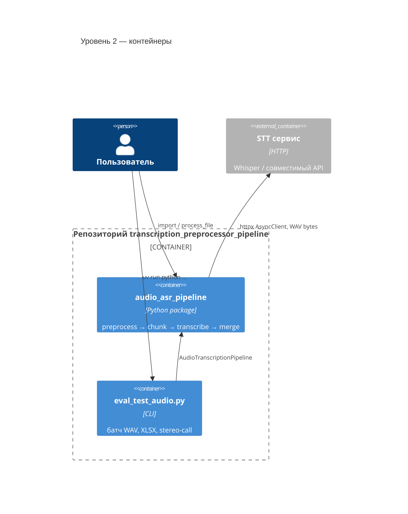
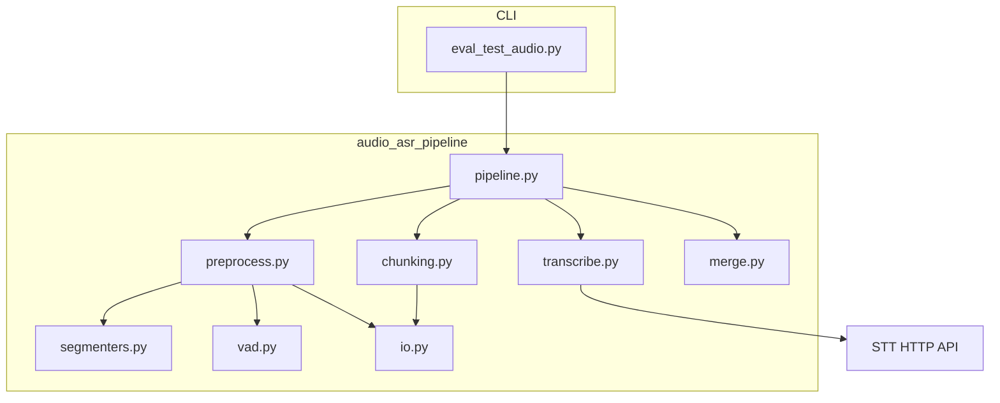
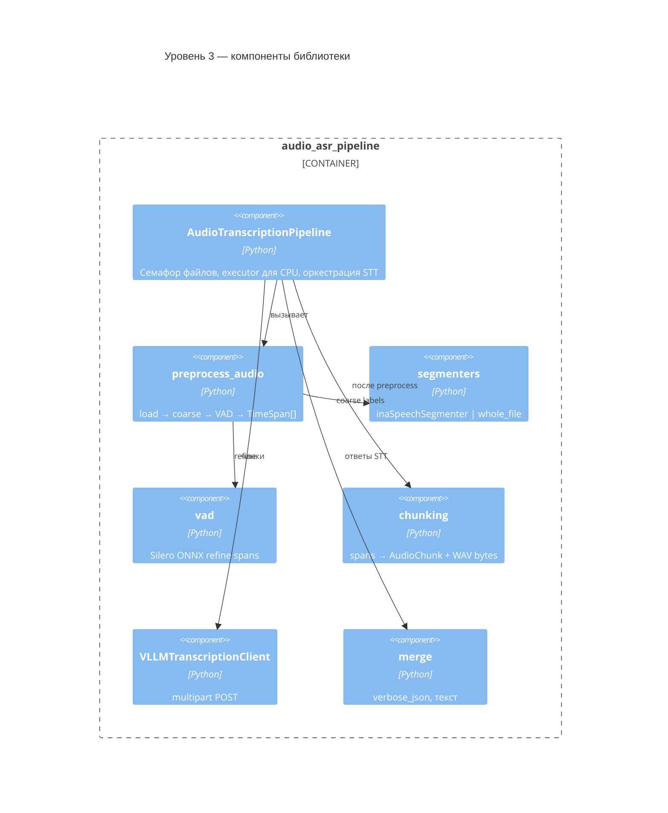
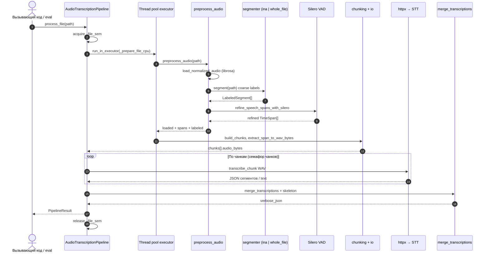
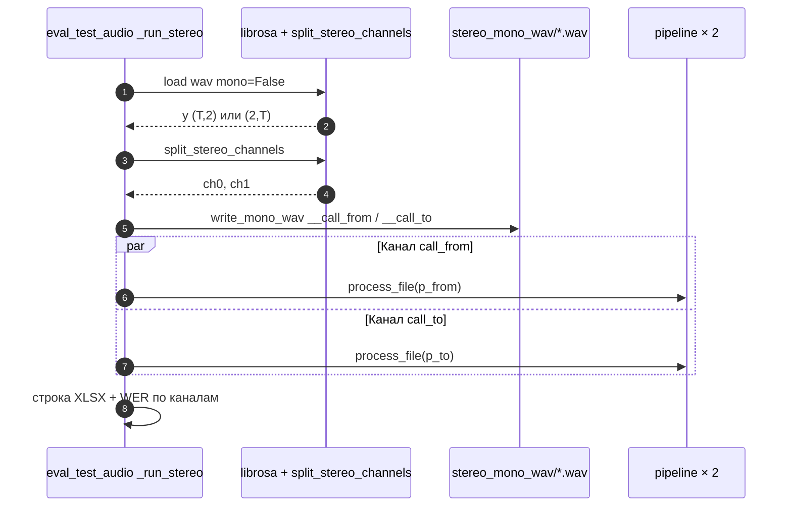

# Архитектура audio-asr-pipeline

Документ описывает назначение системы, основные потоки данных и границы компонентов. Диаграммы в формате [Mermaid](https://mermaid.js.org/) (C4-стиль и последовательности).

## 1. Назначение

Библиотека **`audio_asr_pipeline`** загружает аудио, выполняет грубую сегментацию (речь / музыка / шум), уточняет границы речи через VAD (Silero, ONNX), режет сигнал на чанки и отправляет их в **OpenAI-совместимый** endpoint `/v1/audio/transcriptions` (например, vLLM + Whisper). Результаты объединяются в единый текст и расширенный **`verbose_json`**.

Скрипт **`scripts/eval_test_audio.py`** прогоняет каталог WAV, строит отчёт XLSX (WER/CER, тайминги, RT-метрики) и сохраняет `verbose_json` по файлам. Режим **`--stereo-call`** разделяет стерео на два моно-канала (call_from / call_to), поддерживая обе раскладки librosa `(n_samples, 2)` и `(2, n_samples)`.

## 2. C4: контекст системы

Внешние акторы и системы: оператор/интегратор, файловое хранилище WAV, STT-сервис, опционально ffmpeg (для ina), GPU/CPU для TF и PyTorch.

Если рендерер не поддерживает `C4Context`, используйте эквивалент ниже:

## 3. C4: контейнеры

«Контейнеры» здесь — разворачиваемые/логические единицы: Python-пакет, CLI eval, процесс STT.

Упрощённая блок-схема зависимостей:

## 4. C4: компоненты (внутри пакета)

## 5. Диаграмма последовательности: один файл (mono)

Отражает `AudioTranscriptionPipeline.process_file`: общий семафор `_file_sem` ограничивает число файлов в полном цикле одновременно.

## 6. Диаграмма последовательности: eval stereo-call

Для каждого стерео WAV: загрузка с `mono=False`, `split_stereo_channels`, запись двух моно WAV, затем два параллельных `process_file` (два слота семафоров pipeline).

## 7. Ключевые конфигурационные объекты

| Объект | Файл | Роль |
|--------|------|------|
| `PipelineConfig` | `config.py` | sample_rate, coarse backend, VAD, chunk limits, drop_music/noise/silence, concurrency caps |
| `VLLMTranscribeConfig` | `config.py` | base_url, model, timeouts, trust_env |
| `DEFAULT_COARSE_SEGMENTER_BACKEND` | `config.py` | согласован с дефолтом eval (`ina`) |

Важно: **`max_concurrent_files`** задаёт размер **общего** `asyncio.Semaphore` на экземпляр `AudioTranscriptionPipeline`, поэтому параллельно полностью обрабатывается не больше этого числа файлов (стерео занимает два слота, если каналы гоняются параллельно).

## 8. Ошибки и краевые случаи

| Исключение | Когда |
|------------|--------|
| `AudioLoadError` | Пустое/битое аудио, неверная стерео-форма для split |
| `SegmentationError` | Нет ina, сбой ina, нет speech spans после coarse |
| `TranscriptionRequestError` | Сеть/HTTP/4xx/5xx STT |
| `MergeError` | Несовместимость ответов при склейке (частично mitigated в pipeline) |

При **`fail_fast=False`** типичные сбои загрузки/сегментации/STT для одного пути не пробрасываются наружу из батча: вместо этого для этого файла возвращается **`PipelineResult`** с заполненным полем **`error`** (успех: `error is None`). Подробнее про оркестрацию из Airflow, XCom и синхронные обёртки: **[AIRFLOW.md](AIRFLOW.md)**.

Экземпляр **`AudioTranscriptionPipeline`** рекомендуется закрывать через **`async with`** или **`await aclose()`**: общий **`httpx.AsyncClient`** и (если не передан внешний) внутренний **`ThreadPoolExecutor`** освобождаются при выходе.

## 9. Зависимости (логически)

- **Звук:** librosa, soundfile, numpy  
- **VAD:** torch + Silero через **ONNX** (`onnxruntime`), см. `vad.py`  
- **Coarse ina:** optional extra `ina`, TensorFlow; на Windows в `pyproject` override для plain `tensorflow`  
- **STT:** httpx async, multipart WAV  

## 10. Где читать код

| Модуль | Ответственность |
|--------|-----------------|
| `pipeline.py` | Точка входа async, семафор файлов, `_prepare_file_cpu`, `_transcribe_all` |
| `preprocess.py` | Склейка coarse + VAD + фильтры span |
| `segmenters.py` | ina (в т.ч. female/male → speech), whole_file |
| `vad.py` | Silero ONNX, паддинг/мердж промежутков |
| `chunking.py` | Ограничение длины чанка, `AudioChunk` |
| `transcribe.py` | OpenAI-form POST |
| `merge.py` | Таймкоды, итоговый текст |
| `io.py` | load, WAV bytes, `split_stereo_channels`, `write_mono_wav` |

---

*Для навыков агента Cursor см. `.cursor/skills/audio-asr-pipeline/SKILL.md`.*
