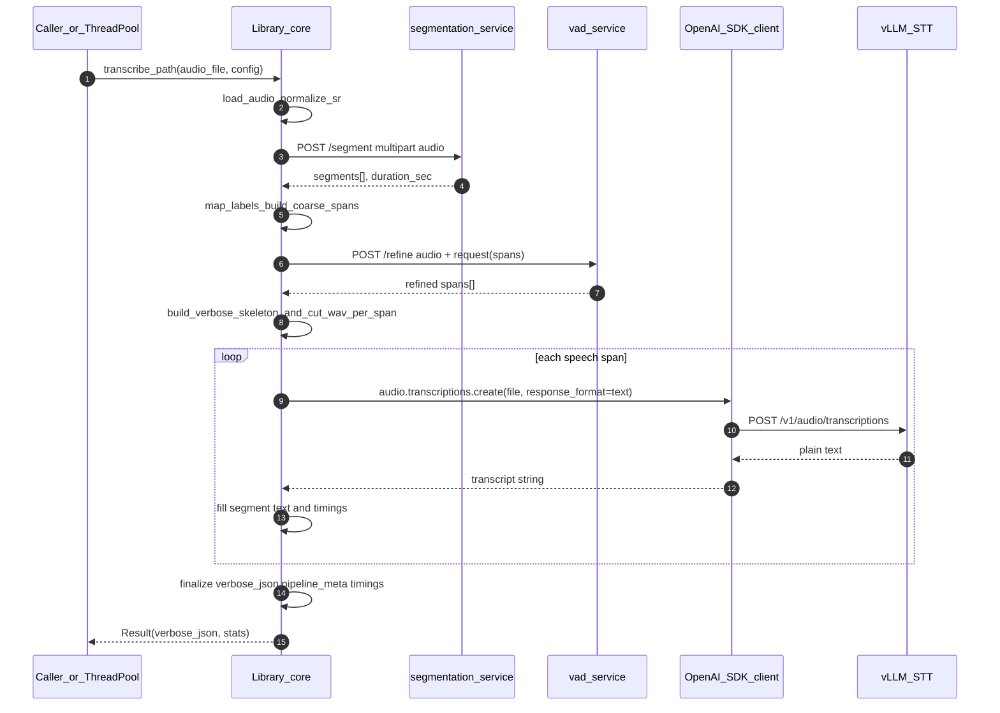
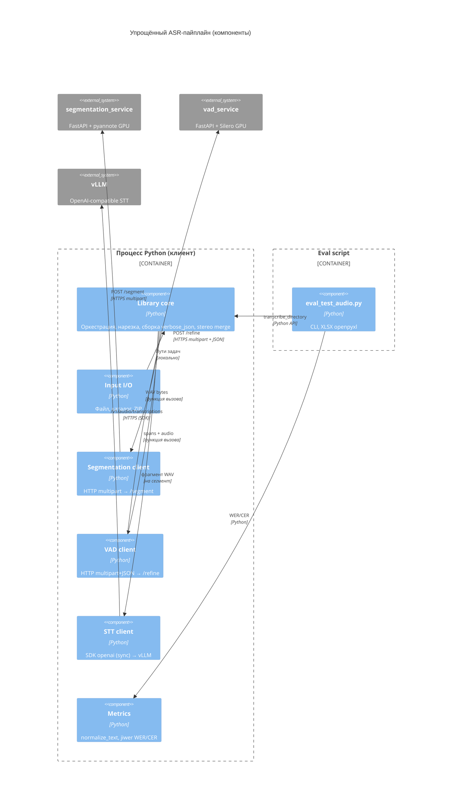
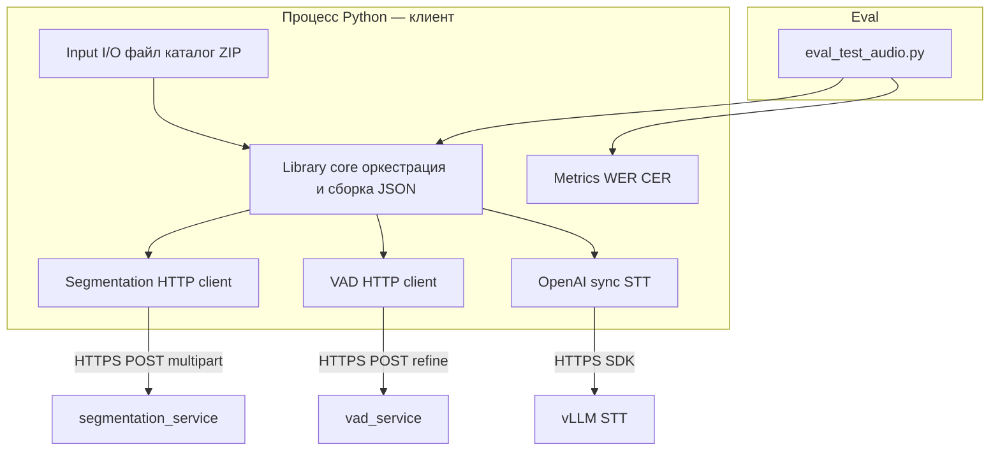

# Техническое задание: упрощённая библиотека пайплайна распознавания речи и скрипт оценки

## Оглавление

1. [Введение и цели](#1-введение-и-цели)
2. [Контекст и наследие текущего репозитория](#2-контекст-и-наследие-текущего-репозитория)
3. [Границы системы и термины](#3-границы-системы-и-термины)
4. [Функциональные требования](#4-функциональные-требования)
5. [Нефункциональные требования](#5-нефункциональные-требования)
6. [Контракты внешних сервисов](#6-контракты-внешних-сервисов)
7. [Формат результата `verbose_json`](#7-формат-результата-verbose_json)
8. [STT: vLLM и SDK `openai`](#8-stt-vllm-и-sdk-openai)
9. [Публичный API библиотеки (черновик)](#9-публичный-api-библиотеки-черновик)
10. [Спецификация `scripts/eval_test_audio.py`](#10-спецификация-scriptseval_test_audopy)
11. [Диаграммы Mermaid](#11-диаграммы-mermaid)
12. [Открытые вопросы](#12-открытые-вопросы)

---

## 1. Введение и цели

**Цель:** спроектировать и затем реализовать **новую упрощённую** библиотеку для пайплайна распознавания аудио, которая:

- работает в **продуктиве** с реальными **vLLM** STT-серверами (OpenAI-compatible API);
- опирается на существующие микросервисы **`segmentation_service`** (pyannote) и **`vad_service`** (Silero GPU);
- **не** дублирует избыточную архитектуру текущего пакета `audio_asr_pipeline` (async-пайплайн, множество бэкендов STT, сложное наследование);
- собирает итоговую разметку **`verbose_json`** **самостоятельно**: временные границы — из сегментации/VAD, текст — из ответов STT при **`response_format="text"`**;
- обеспечивает параллелизм через **`ThreadPoolExecutor`** (до **128** потоков) без обязательного `asyncio` в ядре.

**Цель скрипта оценки:** переписать **`scripts/eval_test_audio.py`** в **простой** инструмент: инициализация через новую библиотеку, прогон по каталогу, метрики **WER/CER** при наличии эталонов, **обязательный** отчёт в **`.xlsx`**.

---

## 2. Контекст и наследие текущего репозитория

Ниже — ориентиры для совместимости форматов и HTTP; реализация по ТЗ **может** быть новым пакетом или major-версией (см. [§12](#12-открытые-вопросы)).

| Артефакт | Назначение |
|----------|------------|
| [`audio_asr_pipeline/merge.py`](../audio_asr_pipeline/merge.py) | Эталон структуры `verbose_json` (поля `text`, `duration`, `segments`, `words`, `pipeline_meta`). |
| [`audio_asr_pipeline/models.py`](../audio_asr_pipeline/models.py) | Эталон типов: длительность, сегменты, результат пайплайна. |
| [`audio_asr_pipeline/io.py`](../audio_asr_pipeline/io.py) | **`split_stereo_channels`** — корректная работа с осью каналов `(n,2)` vs `(2,n)`. |
| [`audio_asr_pipeline/remote_clients.py`](../audio_asr_pipeline/remote_clients.py) | Референс multipart/JSON для segmentation и VAD. |
| [`services/segmentation_service/README.md`](../services/segmentation_service/README.md) | API `POST /segment`. |
| [`services/vad_service/README.md`](../services/vad_service/README.md) | API `POST /refine`. |
| [`audio_asr_pipeline/transcribe.py`](../audio_asr_pipeline/transcribe.py) | **Наследие:** запросы STT с `verbose_json` — **не** соответствуют настоящему ТЗ; новая библиотека обязана использовать только **`response_format="text"`** через SDK **`openai`**. |

---

## 3. Границы системы и термины

- **Сегмент (интервал):** пара времени `[start, end)` в секундах относительно начала обрабатываемого потока (моно или один канал после разделения).
- **Labeled-сегмент:** интервал + **метка** (`speech`, `non_speech`, `music`, `noise`, …) — как возвращает segmentation или как интерпретируется после маппинга.
- **Speech-сегмент (для STT):** интервал, по которому вырезается фрагмент аудио и отправляется в STT.
- **`verbose_json`:** JSON-объект результата транскрипции в стиле OpenAI: минимум поля `text`, `duration`, `segments` (список объектов с `start`, `end`, `text`), опционально `words` (см. [§7](#7-формат-результата-verbose_json)), плюс **`pipeline_meta`** для метаданных пайплайна.
- **Стерео:** канал **0** — семантика **`call_from`**, канал **1** — **`call_to`** (как в текущем eval); разделение через ту же логику, что **`split_stereo_channels`**.
- **Удалённая тишина / нерелевантные регионы:** интервалы, **не** отправляемые в STT; фиксируются в **`pipeline_meta`** (таймкоды + причина/лейбл).

**Вне системы (внешние сервисы):** `segmentation_service`, `vad_service`, сервер **vLLM** (OpenAI-compatible). Библиотека не внедряет GPU-модели напрямую, если выбран remote-режим.

---

## 4. Функциональные требования

Нумерация соответствует постановке задачи.

### 4.1. Ввод данных

1. **Один файл:** путь к аудиофайлу поддерживаемого формата (как минимум те же типы, что принимает `segmentation_service`: WAV, MP3, FLAC, OGG — см. README сервиса).
2. **Каталог:** обход всех подходящих файлов; в ТЗ на реализацию — явный флаг **`recursive: bool`** (рекурсивный обход подкаталогов или только первый уровень).
3. **Архив:** минимум **ZIP**, содержащий один или несколько аудиофайлов (возможна вложенная структура каталогов внутри архива). **Расширение v1.1 (опционально):** `tar.gz`.

Требование: единый API уровня «источник» → нормализованный список задач **(путь или виртуальный путь в архиве, идентификатор, опции)**.

### 4.2. Разделение стерео на каналы

- Опция конфигурации: **`split_stereo=True`** (или эквивалент).
- После загрузки многоканального сигнала применять разделение с **проверкой формы** массива (аналог **`split_stereo_channels`**).
- Далее каждый канал обрабатывается как **независимый моно-поток** (сегментация → VAD → STT → свой `verbose_json`), затем выполняется **склейка** (см. [§4.8](#48-склейка-stereo--один-verbose_json)).

### 4.3. Сегментация через `segmentation_service`

- HTTP **`POST /segment`** на базовый URL сервиса.
- Тело: **multipart**, поле файла **`audio`**.
- Ответ: JSON с **`segments`** (`start`, `end`, `label`) и **`duration_sec`**.
- Маппинг лейблов (как минимум): `speech` → речь; `non_speech` / `non-speech` / `nonspeech` → неречь (типа тишина); при необходимости — `music`, `noise` (референс: `_map_remote_label` в `remote_clients.py`).
- Режим **«только segmentation»:** финальные границы речи для STT извлекаются из labeled-сегментов по правилам (объединение/фильтрация коротких интервалов — параметры конфига).

### 4.4. Уточнение границ через `vad_service`

- HTTP **`POST /refine`**.
- Multipart: **`audio`** (WAV и т.д.) + поле **`request`** (JSON-строка) с массивом **`spans`:** `[{ "start", "end" }, ...]` — **грубые** интервалы речи.
- Ответ: JSON **`spans`** — уточнённые интервалы.
- Параметры порога/длительностей/склейки — из конфига, соответствие полям README **`vad_service`**.

**Комбинации режимов (явно):**

| Режим | Описание |
|-------|----------|
| **segmentation_only** | Только `POST /segment`; интервалы речи из ответа (после маппинга и правил). |
| **vad_only** | Один грубый span `[(0, duration)]` → `POST /refine`. |
| **segmentation_then_vad** | Из segmentation взять только участки с лейблом речи, передать их как `spans` в `POST /refine` (при необходимости — отдельный вызов на весь файл с объединёнными spans). |

Конкретная стратегия «один вызов VAD на файл vs несколько» — решение реализации; в ТЗ: **допускается один запрос `refine` на канал** с массивом всех грубых spans.

### 4.5. Подготовка структуры с таймкодами до STT

- По финальному списку **speech-интервалов** формируется черновик результата: для каждого интервала — элемент в **`segments[]`** с полями **`start`**, **`end`**, **`text`** = `""` (или отсутствует до заполнения).
- Все интервалы **вне** speech (тишина, non_speech, отфильтрованное) перечисляются в **`pipeline_meta`**, например:

```json
"pipeline_meta": {
  "excluded_regions": [
    { "start": 0.0, "end": 0.5, "label": "non_speech", "reason": "below_threshold" }
  ],
  "sources": { "segmentation_url": "...", "vad_url": "..." }
}
```

(Точные ключи — зафиксировать в реализации; смысл — сохранность метаинформации по «удалённой тишине» и нерелевантным участкам.)

### 4.6. STT каждого сегмента (строго vLLM, строго `openai`)

- Использовать **только синхронный** клиент **`OpenAI`** из пакета **`openai`**.
- **`base_url`** указывает на **vLLM** (OpenAI-compatible); при необходимости **`api_key`**.
- Вызов: **`client.audio.transcriptions.create`** (или актуальный метод SDK) с:
  - **`file`** — WAV (или поддерживаемый формат) фрагмента сегмента;
  - **`model`** — имя модели на стороне vLLM;
  - **`response_format="text"`** (обязательно);
  - опционально: **`language`**, **`temperature`**, **`prompt`**.
- **Запрещено** в продуктивном режиме библиотеки для STT: `response_format` ∈ {`verbose_json`, `json`}, прямой HTTP через `httpx`/`requests` к `/v1/audio/transcriptions`.
- Ответ при `text` — **строка**; слова/субсегменты от модели **не** используются для таймкодов.

**Потокобезопасность `OpenAI`:** при реализации зафиксировать одно из (по документации используемой версии SDK):

- один общий клиент на процесс, допускаемый для вызовов из разных потоков; **или**
- **`threading.local`** / отдельный **`OpenAI`** на поток **ThreadPoolExecutor**.

### 4.7. Сборка итогового `verbose_json` из текстов и меток времени

- Для каждого speech-интервала подставить полученный **текст** в соответствующий элемент **`segments[]`**.
- Поле верхнего уровня **`text`:** конкатенация текстов сегментов (с разделителем пробел; порядок — по времени `start`).
- Поле **`duration`:** длительность обрабатываемого потока (канала или целого файла для моно).
- **`words`:** пустой массив **`[]`** либо ключ **отсутствует** (один вариант выбрать и документировать; рекомендация — **`[]`** для совместимости с потребителями, ожидающими массив).

### 4.8. Склейка stereo → один `verbose_json`

- Вход: два канонических `verbose_json` (**левый/канал 0**, **правый/канал 1**).
- Выход: один объект:
  - **`segments`:** объединение списков, **отсортировано по `start`**; у каждого элемента обязательно поле **`channel`** или **`speaker`** со значениями `call_from` / `call_to` (или `left`/`right` — согласовать с потребителем; по умолчанию **`call_from`/`call_to`**).
  - **`text`:** единая строка диалога (порядок — хронологический по времени; при совпадении `start` — порядок канала из конфига).
  - **`duration`:** длительность **исходного стерео** файла.
  - **`pipeline_meta`:** агрегация метаданных по каналам (например `channels: { "call_from": {...}, "call_to": {...} }`), включая **excluded_regions** по каналам и сводные счётчики.

---

## 5. Нефункциональные требования

### 5.1. Параллелизм (`ThreadPoolExecutor`)

- Использовать **`concurrent.futures.ThreadPoolExecutor`** и **`as_completed`**.
- Параметр **`max_workers`:** целое **1…128**.
- **Рекомендуемая базовая стратегия (простая):** параллелизм на уровне **файлов** (и/или элементов из архива); **внутри одного файла** вызовы STT по сегментам — **последовательные**. Это снижает вложенность и нагрузку на vLLM без второго пула.
- **Допущение:** при необходимости ускорения внутри файла — опциональный параметр **`max_segment_workers`** (≤ `max_workers`) с отдельным пулом или семафором; если реализуется — документировать ограничения (нагрузка на GPU STT).

### 5.2. Таймауты, ретраи, соединения

- Настраиваемые таймауты connect/read для HTTP к segmentation/VAD.
- Для STT — таймаут из SDK `openai` / `httpx` underlying (как предоставляет конфиг клиента).
- Ретраи при **429**, **503** с экспоненциальной задержкой и верхней границей (число попыток — конфиг).
- Пул соединений HTTP-клиентов segmentation/VAD: разумный лимит (например через один **`requests.Session`** на поток или пул `httpx`).

### 5.3. Логирование

- Уровни: INFO по умолчанию, DEBUG для диагностики.
- События по этапам: **load**, **segment**, **vad**, **stt** (chunk id / временной интервал), **merge**, **stereo_merge**, ошибки с контекстом пути и идентификатора задачи.

### 5.4. Зависимости

| Область | Зависимости |
|---------|-------------|
| STT | **`openai`** (синхронный API), обязательно. |
| Segmentation / VAD | **`httpx`** или **`requests`**. |
| Аудио I/O, нарезка | по необходимости **`numpy`**, **`soundfile`**, **`librosa`** (если сохраняется совместимость с текущим загрузчиком). |
| Eval-отчёт | **`openpyxl`**, **`jiwer`**. |
| Локальный **ina** / pyannote в библиотеке | **не** требуются, если используются только удалённые сервисы. |

Ядро библиотеки **не** обязано использовать `asyncio` для STT и основного пайплайна.

---

## 6. Контракты внешних сервисов

### 6.1. `segmentation_service`

- **`POST /segment`**
  - **Request:** `multipart/form-data`, поле **`audio`** (файл).
  - **Response (успех):** JSON:

```json
{
  "segments": [
    { "start": 0.0, "end": 0.15, "label": "non_speech" },
    { "start": 0.15, "end": 2.34, "label": "speech" }
  ],
  "duration_sec": 3.0
}
```

- **`GET /health`** — проверка готовности (опционально для клиента).

Подробности и коды ошибок: [`services/segmentation_service/README.md`](../services/segmentation_service/README.md).

### 6.2. `vad_service`

- **`POST /refine`**
  - **Request:** multipart: **`audio`** + **`request`** (JSON-строка):

```json
{
  "spans": [ { "start": 0.0, "end": 5.0 } ],
  "threshold": 0.5,
  "min_speech_duration_ms": 250,
  "min_silence_duration_ms": 200,
  "speech_pad_ms": 200,
  "merge_gap_seconds": 0.5
}
```

  - **Response:**

```json
{ "spans": [ { "start": 0.12, "end": 4.85 } ] }
```

Подробности: [`services/vad_service/README.md`](../services/vad_service/README.md).

---

## 7. Формат результата `verbose_json`

Совместимость с подходом [`build_verbose_json_skeleton` / `merge.py`](../audio_asr_pipeline/merge.py):

| Поле | Описание |
|------|----------|
| `text` | Полный текст. |
| `task` | Рекомендуется `"transcribe"`. |
| `language` | `null` или код языка, если известен из конфига. |
| `duration` | Секунды (float). |
| `segments` | Список `{ "start", "end", "text" }` (+ опционально `channel`/`speaker` после stereo merge). |
| `words` | `[]` или опущено (единая политика). |
| `pipeline_meta` | Исключённые регионы, тайминги этапов, версии, URL сервисов, опции. |

Таймкоды в **`segments`** обязаны соответствовать интервалам, полученным из **segmentation/VAD**, а не из ответа STT.

---

## 8. STT: vLLM и SDK `openai`

- Эндпоинт на стороне сервера: OpenAI-compatible **`/v1/audio/transcriptions`** (клиент задаётся через `base_url` SDK).
- **Единственный** допустимый формат ответа для сегментной транскрипции в рамках ТЗ: **`response_format="text"`**.
- Разметка по словам **не** используется; уточнение word-level — вне scope текущей версии ТЗ.

---

## 9. Публичный API библиотеки (черновик)

```text
@dataclass
class PipelineConfig:
    segmentation_base_url: str | None
    vad_base_url: str | None
    segmentation_mode: Literal["segmentation_only", "vad_only", "segmentation_then_vad"]
    openai_base_url: str
    openai_api_key: str | None
    model: str
    max_workers: int  # 1..128
    split_stereo: bool
    target_sample_rate: int  # например 16000
    recursive_dir: bool
    # таймауты, ретраи, VAD-параметры, trust_env, ...

def transcribe_path(path: Path, cfg: PipelineConfig) -> Result: ...
def transcribe_directory(dir: Path, cfg: PipelineConfig) -> Iterator[Result]: ...
def transcribe_archive(zip_path: Path, cfg: PipelineConfig) -> Iterator[Result]: ...
```

**Модуль метрик (в той же библиотеке):**

- `normalize_text_for_wer_cer(text: str) -> str` — приведение к нижнему регистру, удаление пунктуации, нормализация пробелов (эквивалент текущей логики eval).
- `wer(reference: str, hypothesis: str) -> float`, `cer(...)` — обёртки над **`jiwer`** после нормализации.

**`Result`** должен содержать как минимум: путь источника, итоговый **`verbose_json`**, разбивку **времени по этапам** (секунды), опционально **`error`**.

---

## 10. Спецификация `scripts/eval_test_audio.py`

### 10.1. Назначение

- Инициализировать объекты **только** через новую библиотеку.
- Запустить обработку для **указанной директории** (и опционально одного файла тем же CLI).
- Получить расшифровки через API библиотеки.
- При наличии эталонных **`.txt`** — вычислить **WER** и **CER** после **`normalize_text_for_wer_cer`**.
- Записать **строго** отчёт **`.xlsx`** через **`openpyxl`**.

### 10.2. CLI (минимальный набор)

- Путь: `--audio-dir` и/или `--audio-file`.
- `--workers` (1…128).
- `--segmentation-url`, `--vad-url`, `--openai-base-url`, `--model`, `--api-key`.
- Флаг стерео (например `--stereo-call`).
- `--output` / каталог прогона по умолчанию (например `eval_runs/<timestamp>/report.xlsx`).

### 10.3. Эталоны для stereo

- Канал 0: `{stem}_call_from.txt`, канал 1: `{stem}_call_to.txt` рядом с WAV (как в текущем скрипте).
- Для моно: один `{stem}.txt` или соглашение, зафиксированное в README скрипта.

### 10.4. Листы Excel

1. **Детальный:** по каждому файлу — путь, длительность, гипотеза, эталон (если есть), WER, CER, время этапов (segmentation, vad, stt, total), число сегментов, сообщение об ошибке.
2. **Сводный:**
   - общее **wall time** прогона;
   - **`max_workers`**;
   - по WER/CER: **mean, median, p25, p75, n** (как в текущем `_dist_summary`);
   - среднее время на файл;
   - распределение времени обработки одного файла и длительности аудио;
   - **RT-метрики этапов:** секунды обработанного аудио на **1 с** wall time этапа:

\[
\text{rt\_stage} = \frac{\text{audio\_duration\_sec}}{\text{stage\_wall\_time\_sec}}
\]

   - этапы: **segmentation**, **vad**, **stt**, **полный пайплайн** (и для stereo — по каналам при необходимости).

JSON/CSV как основной вывод **не** использовать.

---

## 11. Диаграммы Mermaid

### 11.1. Диаграмма последовательности (один моно-файл, segmentation → VAD → STT)



**Стерeo (кратко):** после загрузки — **`split_stereo_channels`**; для каждого канала — тот же поток до `verbose_json`; затем **`merge_stereo_verbose_json`** → один результат.

### 11.2. C4: уровень компонентов



> **Примечание:** если среда просмотра Markdown **не рендерит** диаграммы **`C4Component`**, использовать альтернативу ниже.

### 11.3. Запасной вариант: `flowchart` с границами



---

## 12. Открытые вопросы

1. **Имя пакета:** полная замена `audio_asr_pipeline` vs новый namespace (например `audio_asr_simple`) и миграция импортов.
2. **Архивы:** только ZIP в v1 или сразу `tar.gz`.
3. **Word-level таймкоды:** не входят в scope при `response_format=text`; отдельная будущая задача (другой контракт STT или локальное выравнивание).
4. **Поддержка C4 в Mermaid:** версия Mermaid в CI/документации должна поддерживать `C4Component`; иначе опираться на §11.3.

---

*Документ: ТЗ на реализацию; код по ТЗ не включён.*
